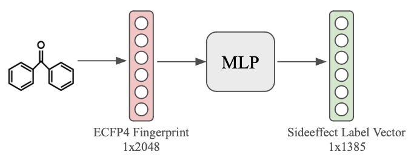
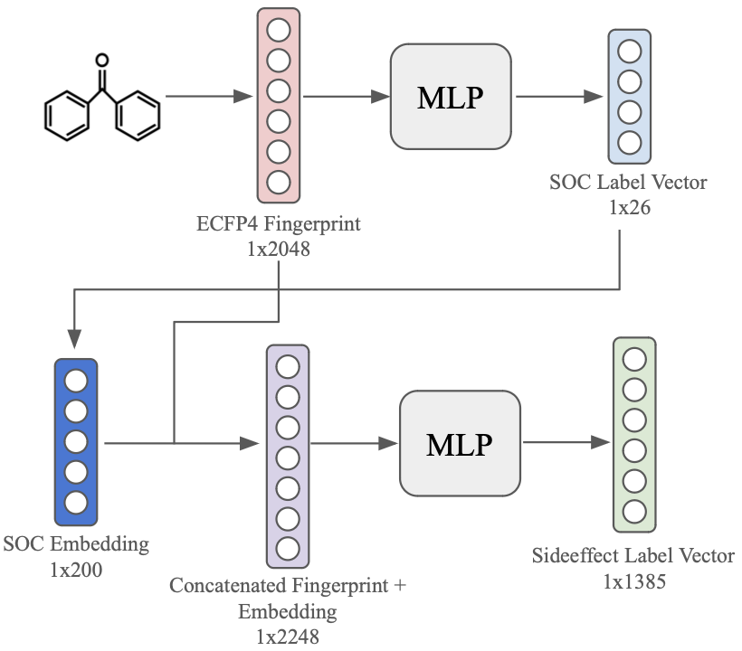
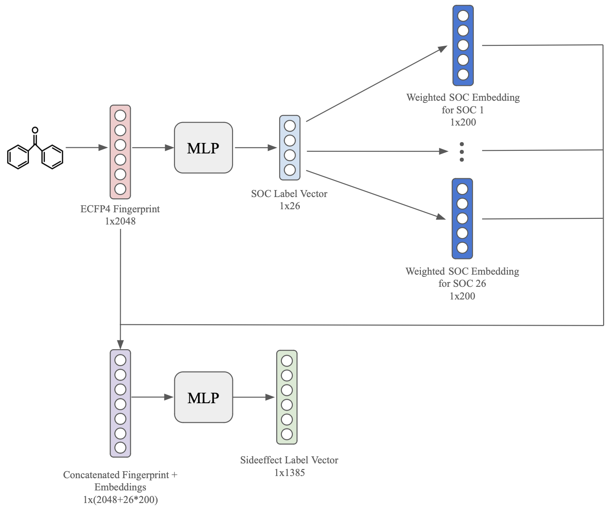
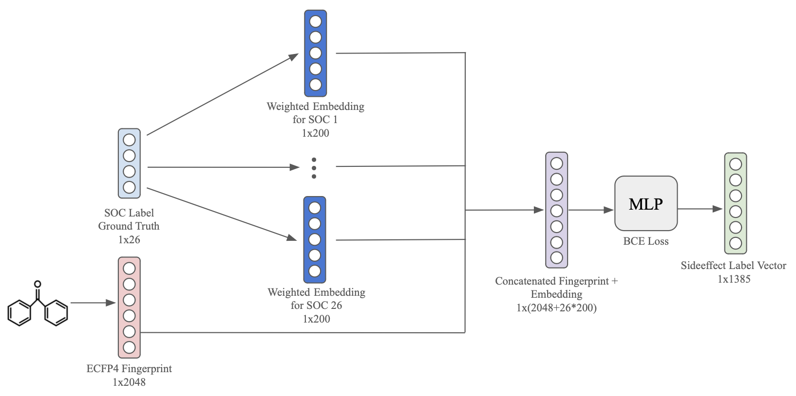
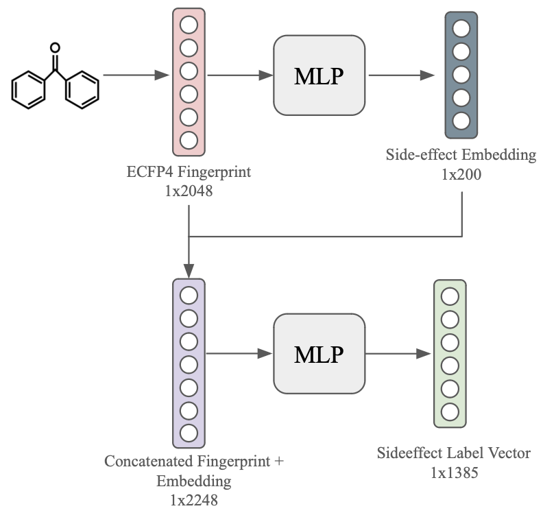
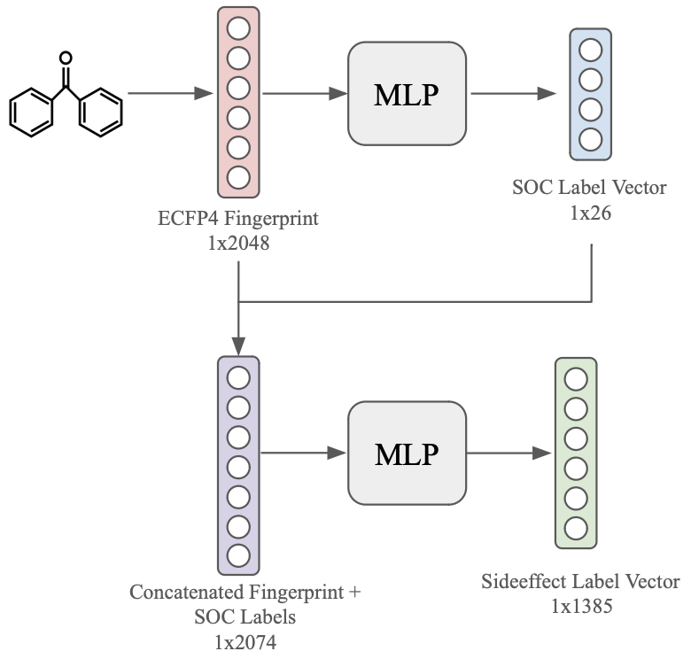

# Predicting-Drug-Side-Effects
Code for the paper "Enhancing Drug Side-Effect Prediction With Word Embeddings And Label Taxonomy". We enhance an MLP with supplementary information from word embeddings and label taxonomy to further exploit label correlation in the high-dimensional, multi-label classification problem of in silico drug side-effect prediction.

## How To Use
1. Configure hyperparameters in code/hyperparameters.yaml. 
2. Run the respective function in main.py  
    2a: Training and validation scripts for the various models from the paper:
    - run_mlp_baseline(): For Baseline MLP, from Section 2.5.1
    - run_mlp_concat(): For MLP Concat, from Section 2.5.2
    - run_mlp_mega_concat(): For MLP Mega Concat, from Section 2.5.2
    - run_mlp_concat_w_se_embeds(): For MLP Concat With Side-effect Embeddings, from Section 2.5.2
    - run_mlp_concat_w_soc_labels(): For MLP Concat With SOC Labels, from Section 2.5.2
    - run_mlp_mega_concat_cheat(): For MLP Mega Concat (Cheated Model), from Appendix B.2
  
    2b: Generate the dataset to use  
   (NOTE: Default datasets are already in the repo. You do not have to run these to run the scripts above.):
    - generate_soc_data(type, aggregate, randomise): See documentation for how to use
    - generate_se_embedding(vec_path): See documentation for how to use

## Model Architectures
<table align="center">
  <tr>
    <td align="center" width="500">
       
      MLP Baseline Model Architecture
    </td>
    <td align="center" width="500">
       
      MLP Concat Model Architecture
    </td>
  </tr>
  <tr>
    <td align="center" width="500">
       
      MLP Mega Concat Model Architecture
    </td>
    <td align="center" width="500">
       
      MLP Mega Concat (Cheated) Model Architecture
    </td>
  </tr>
  <tr>
    <td align="center">
       
      MLP Concat With Side-effect Embeddings Model Architecture
    </td>
    <td align="center">
       
      MLP Concat With SOC Labels Model Architecture
    </td>
  </tr>
</table>
